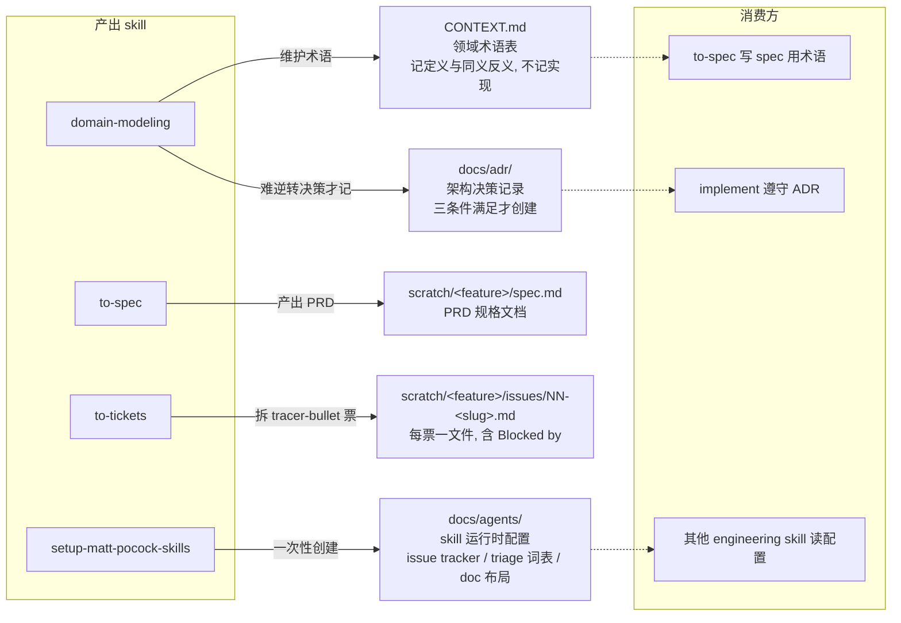
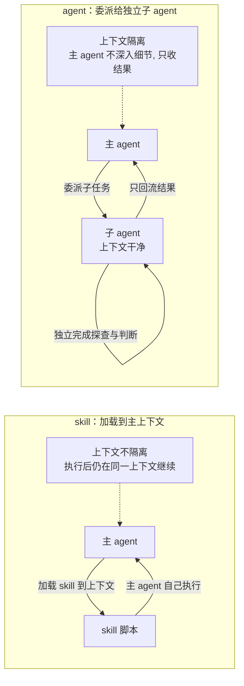
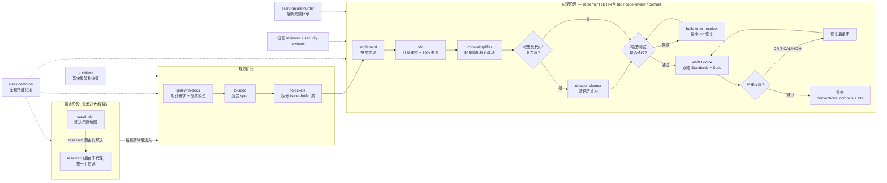
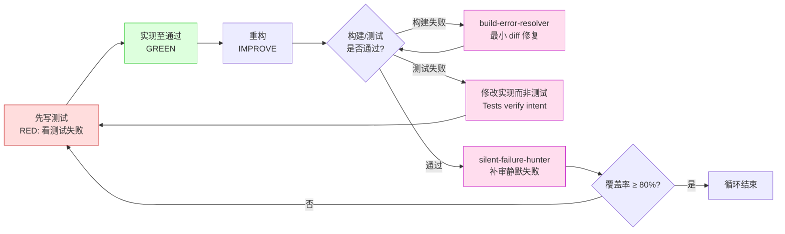

# 这套 AI Agent 资产体系：能力、设计依据与工作流

> 受众：团队成员与开源读者。仓库源码完全公开，故本文不复述源码内容，仅阐述源码无法直接读出的层面——各类资源所解决的问题、分层设计的依据、以及它们在工作流中的协作方式。涉及具体配置处，文中标注路径，供读者自行查阅。

## 总述

该仓库（`ai-assets`）并非 AI 工具箱合集，而是一套**跨平台、单一真相源**的 Agent 资产治理中枢——一处维护 `rules + skills + agents + mcp`，通过 `install.py` 一键分发至 Claude Code / Cursor / Codex / pi 四个平台。

所有资源按**职责**分为三层（mcp 内容较少，本篇不展开）：

| 层 | 定位 | 解决的问题 |
| ---- | ------ | ----------- |
| **rules** | 规范与约束 | 在 agent 动手之前，确立"该怎么做"与"不能怎么做" |
| **skills** | 工作流与领域知识 | 在特定场景下，提供"正确的做事步骤"与"应遵循的模式" |
| **agents** | 专家角色 | 将需要判断力的子任务，委派给职责边界明确的子 agent |

三层并非平行：rules 为底座（永远生效），skills 为场景脚本（按需触发），agents 为委派目标（按需调用）。下文逐层阐述。

---

## 一、Rules：在动手之前确立规范

rules 分为两个文件，前者是 agent 的全局角色与认知底座，后者是按正交关注点拆分的常驻规则集合，两者共同构成"出厂设置"。

### 1.1 `global-instructions.md`：agent 的角色与认知底座

该文件部署为各平台的 `CLAUDE.md` / `AGENTS.md`，定义 agent 的身份与思考方式。它解决的核心问题是：**LLM 默认的讨好型人格与模糊表达，在工程场景中会放大风险**。一个不敢说"我不确定"、只会顺着用户说话的 agent，在架构决策或排障时会把模糊假设伪装成确定性结论，导致错误被层层传递才暴露。该文件的四个小节即针对这一失败模式逐项设防。

**通用认知原则**——为什么需要单独规定"诚实"与"表达"：

- 绝对诚实与主动暴露，针对的是 LLM 的幻觉倾向——不确定时若不强制声明，模型会用流畅的编造填补空白，且不告知用户哪些是编造。要求"不确定直接声明"是把知识边界显性化，让用户能区分"确凿事实"与"模型推测"。
- 反谄媚（Anti-Sycophancy），针对的是 LLM 的顺从偏好——模型天然倾向于肯定用户、避免反驳。但在架构判断中，用户假设若有漏洞而 agent 不驳，错误就会在实现阶段才暴露，返工成本远高于初期一句反驳。要求"先给反例再表态同意"，本质是强迫 agent 在附和前先做证伪尝试，证伪失败才同意。
- 无废话原则，针对的是输出信噪比——客套与免责声明不承载信息，却占用上下文窗口与读者注意力。工程场景要求高信噪比，故直接禁止情绪化填料。
- 金字塔表达与 MECE，针对的是 LLM 常见的"先堆细节再给结论"叙事——读者在拿到结论前需读完所有细节，一旦结论不符需回头重读。要求"先结论后论据"让读者能在第一句决定是否继续深入，降低决策成本。
- 语言规范，针对的是混合语言污染——沟通用简体中文而代码产物用英文，是因为代码注释、commit message、技术文档需跨团队/跨工具流转，强制中文反碍于协作。

**分析与决策准则**——为什么需要单独约束"思考环节"：

- 认知标记（`[事实]`/`[推论]`/`[假说]`），针对的是 LLM 将猜测伪装为事实的倾向——模型会以同样自信的语气输出"某 API 返回 JSON"（事实）与"某方案应该可行"（假说），读者无法区分。强制标记是把知识边界穿透到输出层面，让用户能对各结论按可信度差异化对待。不标在代码块/commit/文档正文，是为避免污染工程产物。
- 逆向思维优先，针对的是确认偏误——评估方案时模型会顺着"为什么可行"思考，而非"什么条件下失效"。要求先找失效条件，是因为一个无法被证伪的方案往往意味着没想清楚，而非真的无懈可击。
- 框架与现实剥离，针对的是"理论最优≠现实可行"的混淆——模型易用理论模型的推演直接套用现实，忽略部署约束、团队成熟度、历史债务。要求显性区分两者，是为防止"理论上完美但落地即崩"的方案。

**冲突裁决**——为什么需要明确规则优先级：当用户临时指令与全局规则冲突（如要求伪造信息、编写高风险代码）时，若无明确优先级，agent 会因顺从偏好而执行危险指令。该节规定优先遵循规则并告知冲突点，是为给 agent 一个"拒绝"的合法依据，而非靠模型自行权衡。

**搜索与信息检索策略**——为什么要把检索工具选择写进 rules：agent 默认会用内置的 `WebSearch`/`WebFetch`，但 `anysearch` 在垂直域查询与多意图并行上结果更优（详见 2.3 节）。将该选择固化为规则而非让 agent 每次自行判断，是为避免模型因图省事而退回内置工具、牺牲检索质量。回退路径明示"不可用时"才用内置工具，是为给降级留出口而非硬绑。

### 1.2 `rules/common/`：按正交关注点拆分的常驻规则

该目录含 10 个文件、约 465 行。其设计原则是**按关注点正交拆分而非合并**——原因在于 agent 遵守规则需先定位规则，单个文件管一个关注点，模型在"安全检查"时只需加载 `common-security.md` 而非扫读全量；若合并为大文件，检索成本与遗漏风险同步上升。下文逐文件说明其要防的失败模式与为何如此设计。

#### 认知与行为底座

- `KarpathyGuide.md`（108 行，篇幅最长）——12 条 Karpathy 准则。该文件存在的理由是：**通用编码规范答不了"agent 该怎么做事"这个问题**。规范管"代码长什么样"，准则管"动手前的判断流程"。几条关键准则的设计动机：
  - Think Before Coding（不假设、有歧义即问）：针对 LLM 趋于"先写再说"的倾向——模型会基于默认假设直接产出代码，而错误假设导致的返工远大于开口问一句的成本。
  - Simplicity First（200 行能写 50 行即重写）：针对 LLM 的过度工程倾向——模型会为单次使用添加抽象、为不可能场景加错误处理，产出"看起来专业实则冗余"的代码。
  - Surgical Changes（仅动该动之处）：针对"顺手改"的诱惑——agent 在改一处时易顺手重构相邻代码，引入未要求的变更，使 review 无法聚焦。
  - Fail loud（无法确定成功则明说）：针对静默失败——模型会报"迁移完成"而掩盖跳过的记录，问题被隐藏到爆发。该准则与 3.3 节的 `silent-failure-hunter` agent 互为表里，一个防"主动报喜"，一个查"被动隐藏"。
  - 其余准则（Read before you write、Tests verify intent、Checkpoint 等）同理，均是把工程经验中"好工程师会但不写下来的判断"显式化为可执行规则。

- `common-coding-style.md`——编码风格规范。不可变性标为 CRITICAL 的原因：新代码原地修改会产生隐藏副作用，使调试与并发推理均变难；要求创建新对象而非原地改，是把"副作用"从隐式变为显式。文件组织规定 200-400 行典型、800 上限，针对的是 LLM 倾向于在单文件堆叠所有逻辑——拆分按领域而非按类型，是为保持高内聚低耦合。输入验证要求"在系统边界处校验、fail fast"，是因为边界外的数据不可信，晚校验会导致错误在内部传播后才暴露，定位成本高。

#### 工程规范

- `common-development-workflow.md`——特性实现流水线。该文件存在的理由是：**不把流程写成 skill 而写成 rule，是因为流程是必须遵守的约束而非可选脚本**。它定义 Plan（`/grill-with-docs` 对齐需求与领域模型 → `/to-spec` 沉淀 spec → `/to-tickets` 拆 tracer-bullet 票）→ TDD（`/tdd` 红绿重构，80%+ 覆盖）→ Code Review（`/code-review` 双轴 Standards + Spec）→ Commit（conventional commits）的顺序。每个环节的 skill 是"怎么做"，这条 rule 是"必须按这个顺序、不能跳步"——跳过 spec 直接 implement 是 agent 常见失败，需求未对齐即写码会导致整体返工。

- `common-git-workflow.md`——Git 规范。分支策略采用 GitHub Flow 而非 Git Flow，原因是个人/小团队场景下 Git Flow 的 release 分支与 hotfix 分支是过度设计。commit message 要求 conventional commits 格式（`<type>: <description>`）与原子提交，是为让 git history 可被自动解析与回溯——type 标签使变更分类可机读，原子提交使每个 commit 可独立 revert。worktree 约定（置于仓库外、一分支一 worktree、依赖不共享），针对的是 stash + branch-switching 的痛点：stash 易丢失、切换需重装依赖，worktree 让并行任务各自独立。

- `common-testing.md`——测试要求。80% 覆盖率底线的设计权衡：覆盖率过低则测试价值存疑，过高则投入产出比递减、为覆盖而写无效测试。80% 是工程经验上的平衡点。TDD 强制而非可选，是因为"先写测试"强迫在实现前明确意图与边界条件，这一步思考的价值大于测试本身——这正是 KarpathyGuide "Tests verify intent" 的制度保障。

- `common-security.md`——安全规范。该文件设计为"提交前 checklist + 响应协议"双层：checklist 防漏检（无硬编码密钥、输入校验、参数化查询等），响应协议防拖延（发现即 STOP、调 security-reviewer、修 CRITICAL、轮换密钥、全库审查同类问题）。全库审查的要求针对的是"单点发现即止"的侥幸——一个 SQL 注入点往往意味着同模式的其他位置均有问题，只修一处是埋雷。

#### 协作与治理

- `common-code-review.md`——代码评审标准。严重程度分级（CRITICAL/HIGH/MEDIUM/LOW）的设计价值在于**统一评审输出契约**：不同 reviewer agent 的关注点不同，若无统一分级，各自的输出无法被下游（如 PR 是否可合并）机械判断。分级后，"无 CRITICAL/HIGH 则通过"成为可机读的合并门槛，agent 不需再人工权衡"这个问题严不严重"。安全触发器清单（鉴权、用户输入、数据库查询等）明示"何时必须调 security-reviewer"，是为防 agent 在安全敏感场景"自审"而非委派专家。

- `common-agents.md`——agent 编排。该文件解决两个问题：一是两个架构 agent 的边界（`architect` 为系统级，`code-architect` 为特性级），其分工原因详见 3.1 节。二是多视角分析角色（Factual reviewer / Senior engineer / Security expert / Consistency reviewer / Redundancy checker）的定义——针对的是单视角评审的盲区：一个 reviewer 易陷入单一思维框架，多角色并行能覆盖"事实准确性/工程判断/安全/一致性/冗余"五个正交维度，结果合并后才得结论。

- `common-tech-stack.md`——**硬约束**：Python 仅用 `uv`、Node 仅用 `pnpm`。表面为偏好选择，实为防止 agent 生成不统一的依赖管理命令——若不锁定，模型会依训练数据偏好混用 pip/conda/npm/yarn，导致 lockfile 不一致、依赖不进 `pyproject.toml`、团队协作时环境不可复现。"用户提供 npm 指令自动转换为 pnpm"的规则，是为在不拒绝用户输入的前提下保持一致性。

### 1.3 两类规则，两种部署模型

rules 目录下分两类，其**加载方式**完全不同，此为第一层设计权衡：

- **`rules/common/`**（上文）：常驻规则。所有平台、所有项目、所有时刻均加载，是 agent 的出厂设置。
- **`rules/{java,python,react}/`**：条件规则。仅在打开对应类型文件时触发（Java 规则匹配 `**/*.java`，Python 匹配 `**/*.py`，React 匹配 `**/*.tsx`）。

如此分层的原因在于：agent 的上下文窗口有限，常驻规则越多，留给实际任务的有效上下文越少。**仅在用得上的时刻将规则灌入上下文**，属于上下文带宽优化。其代价在于需维护"规则→文件类型"的映射（Cursor 称 `globs`，Claude 称 `paths`，Codex 不支持条件触发、只能整体嵌入 AGENTS.md），`install.py build` 负责将该映射转换为各平台所识别的格式。

另需指出一处平台差异：Codex 设有 32KB 的 AGENTS.md 上限且不支持条件规则（无 frontmatter），故 `global-instructions.md` 实际上是 common rules 的精编嵌入版，将核心内容揉成一份部署为各平台的 `CLAUDE.md` / `AGENTS.md`。此即 `global-instructions.md` 与 `rules/common/` 内容存在重叠的原因：前者为不支持条件加载的平台提供兜底全量包，后者为支持的平台提供细粒度版本。详见 `global-instructions.md` 及 `install.py` 的 build 逻辑。

---

## 二、Skills：场景触发的工作流与领域知识

skills 是数量最多的一层，共 38 个。按主题分组阐述如下。

### 2.1 工程工作流链

该组定义从需求到交付的完整链路，是仓库中最重要的一组：

- `grill-with-docs` → `to-spec` → `to-tickets` → `implement` → `code-review`

每个环节为独立 skill：`grill-with-docs` 持续追问以对齐需求、建立领域模型；`to-spec` 将对话沉淀为 spec；`to-tickets` 拆分为 tracer-bullet 票；`implement` 按票实现；`code-review` 双轴评审（Standards + Spec，并行子 agent）。该链路的设计价值在于：将"需求对齐—规格化—任务拆分—实现—评审"完整闭环显式化为可执行步骤序列，避免跳步导致的返工。

该链路有两个常用配套 skill 位于链路前端，处理"需求尚未成型"的阶段：

- `wayfinder`：规划超大块工作（超过单个 agent session 容量）的工具。当目标模糊且路径不可见时，不直接冲向终点，而是把目标画成 issue tracker 上的"决策票地图"——每张票解决一个决策而非切片构建，逐个解决直到路径清晰。其设计核心是**规划而非执行**：地图是索引不是存储，决策只活在它自己的票里；有 fog of war 机制（刻意不画看不清的部分，随推进逐渐清晰）。调用分两模式——chart the map（建图）与 work through the map（推进）。每 session 至多解决一张票（research 票除外）。其定位是对 `to-spec`/`to-tickets` 的前置补充：后者处理"需求清晰、可拆票"的场景，wayfinder 处理"需求太大太糊、连怎么走都不确定"的场景。
- `research`：后台调研子代理，对**一手信源**（官方文档、源码、spec、一方 API）做调查，写成 markdown 存入仓库，每条结论标信源。其设计核心是**后台运行、主 agent 继续干活**——调研是耗时 I/O，阻塞主 agent 不值得，故委托给后台子代理。在 wayfinder 中，`research` 类决策票（AFK 类型）明确由 `/research` 子代理解决；在工作流中，任何需要查文档/API 事实的环节均可触发。

其余配套 skill 包括 `tdd`（红绿重构循环）、`diagnosing-bugs`（硬 bug 诊断循环）、`prototype`（验证设计感的抛弃式原型）。

#### grilling：工作流的根节点

在上述所有 skill 中，`grilling` 是最底层的一个，也是整个 mattpocock 工作流的根节点——`grill-me`、`grill-with-docs` 均为它的上层包装（分别触发纯对话 session 与带文档 session）。其定位不是"提供步骤"，而是**在动手之前通过 relentless 追问达成共识**。核心设计如下：

**单问单答、逐枝推进**。要求一次只问一个问题、等用户反馈后再继续，禁一次抛多个问题（"Asking multiple questions at once is bewildering"）。沿决策树的每个分支逐个推进，依赖按序解决——这针对的是 LLM 趋于一次性产出多步方案的倾向，多问齐发会让用户难以逐条审视，且决策间的依赖关系会被掩盖（后一个问题可能依赖前一个的答案）。

**事实查环境、决策问用户**。明确区分两类信息：**事实**（filesystem、工具可查的）由 agent 主动探查环境获取，不问用户；**决策**（取舍、偏好、选择）必须逐个抛给用户并等答案。这条约束针对的是 LLM 的两种失败模式：一是把可查的事实当决策问用户（浪费用户注意力、降低信任），二是把本属用户的决策自行假设默认值（错误伪装成确定结论）。

**为每个问题提供推荐答案**。追问不是纯开放式提问，而是每问必附 agent 的推荐答案，用户可采纳可推翻。这针对的是"开放式提问但无方向"的低效——纯开放问题让用户从零思考，附推荐答案则把对话从"从头想"变为"判断对错"，判断成本远低于创造成本。

**未达共识不动手**。在用户确认达成共识前，agent 不执行任何实际改动。这针对的是 LLM "边问边做"的倾向——模型会在追问中途开始实现，而未达共识的实现建立在未对齐的假设上，返工成本高。

**grilling 在工作流中的位置**。它是 `grill-with-docs`、`wayfinder`、`to-spec`、`grill-me` 等多个 skill 的起点环节，凡需"先对齐再动手"的场景均由 grilling 起步。其与 `domain-modeling` 的组合（即 `grill-with-docs`）会同步产出 ADR 与 glossary——domain-modeling 负责把追问中达成共识的术语与决策实时落盘（`CONTEXT.md` 记术语、`docs/adr/` 记难逆转的权衡决策），grilling 负责"追问到共识"的过程，两者分工为"过程"与"产物"。

**为何说它是根节点**。工作流链的后续环节（to-spec、to-tickets、implement、code-review）均建立在"需求已对齐"的前提下；而"需求对齐"这个前提，正是由 grilling 达成。跳过 grilling 直接进 to-spec，会把未澄清的假设带入 spec，返工成本随环节推进指数增长。故 grilling 是整条链的地基，其设计质量直接决定后续环节的有效性。

#### 与同类 skill 集合（superpowers / gsd）的差异

本地另一套 skill 集合 superpowers 与开源项目 gsd（Get Shit Done）也含 TDD 与 code-review，但设计哲学与 mattpocock 版本差异显著。三套 skill 对同一环节给出了不同的解决路径，揭示三种取舍：

**TDD 差异**——

| 维度 | mattpocock `tdd` | superpowers `test-driven-development` | gsd `tdd` |
| ------ | ------------------- | -------------------------------------- | ------------ |
| 基调 | 方法论约束，定义循环纪律 | 铁律执行，反驳合理化借口 | 流水线化执行，gate 强制 |
| 核心机制 | seam（先确认公共边界再写测试）+ vertical slice 禁 horizontal slicing + 反模式清单 | "NO PRODUCTION CODE WITHOUT A FAILING TEST FIRST"，重点在"先看测试失败"证明测试有效 | TDD plan 结构化，gate 强制 RED/GREEN/REFACTOR commit 模式，fail-fast 规则 |
| Refactor 归属 | 不在循环内，归 `code-review` | 在循环内 | 在循环内（作为可选 gate） |
| 执行产物 | 无固定 commit 模式 | 无固定 commit 模式 | 固定 commit pattern `test/feat/refactor({phase}-{plan}): ...`，每 plan 产 2-3 个原子 commit |
| 质量保障 | 反模式清单可诊断失败模式 | "红旗清单"指向"删除代码重来" | gate validation 检查 RED/GREEN commit 是否存在，phase 末 review checkpoint |

mattpocock `tdd` 的核心机制 seam 值得单独展开。seam 的本质是**只测公共边界、不测实现细节**——测试在公共接口上观察行为，而非深入内部或 mock 内部协作者。该原则的依据是：代码可整体重构而行为不变，测试不应随实现变动而断。mattpocock 以三个机制落实该原则：其一，seam 作为"观察行为而不深入内部"的公共边界，测试只在 seam 上写、不在 internals 上写；其二，要求先与用户确认 seam 再写测试，把"测什么"从 agent 自行判断提升为显式契约，避免 agent 在未确认的边界写测试导致覆盖偏离关键路径；其三，将 implementation-coupled（mock 内部协作者、测私有方法、通过旁路验证如查数据库而非用接口）列为反模式，诊断特征是"重构时测试会断但行为没变"——这正是违反"测边界不测细节"的典型症状。该原则与 superpowers、gsd 的差异在于：后者两套均强调"先写测试"与"测试质量"，但未将"测边界不测细节"作为可诊断的失败模式与契约机制显式约束。

三者的根本差异在**设计哲学**：mattpocock 版假设"agent 会走捷径"，用机制设计（seam 确认、vertical slice）防偏，产出可审查的测试设计；superpowers 版假设"agent 会找借口跳过 TDD"，用铁律与反驳预设借口防偏，产出"先看失败"的证明；gsd 版假设"agent 会跳步或伪造 TDD"，用 gate 强制 commit 模式与 fail-fast 规则防偏，产出可机读的 gate 合规报告。Refactor 归属是关键权衡：mattpocock 将其分离至 review 阶段，使实现与重构职责正交、反馈闭环显式；superpowers 与 gsd 均留在循环内，保持单环节内完整闭环，但模糊实现与重构边界。

**code-review 差异**——

| 维度 | mattpocock `code-review` | superpowers `requesting-code-review` + `receiving-code-review` | gsd `gsd-code-reviewer` |
| ------ | -------------------------- | -------------------------------------------------------------- | ------------------------- |
| 结构 | 单 skill，双轴并行 | 两 skill 拆分：请求评审 + 接收反馈 | 独立 agent，由 `/gsd:code-review` 命令 spawn |
| 评审轴 | 双轴（Standards + Spec）独立子 agent 并行，不合并发现 | 单轴 checklist（代码质量/架构/测试/需求/生产就绪） | 单轴对抗式（bugs/security/质量），假设每份实现都有缺陷 |
| 严重程度 | 依赖仓库分级（CRITICAL/HIGH/MEDIUM/LOW） | 三级（Critical/Important/Minor） | 两级（BLOCKER/WARNING） |
| 深度 | 不分深度 | 不分深度 | 三深度（quick grep 模式 / standard 逐文件 / deep 跨文件追调用链） |
| 产物 | 两轴分离发现列表 | 按严重程度分级的发现 + 合并判定 | 结构化 REVIEW.md（带 status/findings 计数），可选 `--fix` 自动修复 |
| 反馈接收 | 未单独规定 | 单独 skill：禁表演式同意、先验证再实现、YAGNI 检查、遇冲突上报 | 不负责接收，专注对抗式找问题 |

三者的根本差异同样在**设计哲学**：mattpocock 版关注"评审本身怎么不漏"——双轴并行防一轴掩盖另一轴，产出两个分离发现列表；superpowers 版关注"反馈怎么被正确接收与执行"——拆分请求与接收，接收端规定禁表演式同意、YAGNI 检查、遇冲突上报；gsd 版关注"怎么系统化找出缺陷"——对抗式假设（代码必有缺陷）、三深度按需扩展（quick 到 deep）、语言感知检查、结构化产物。三者覆盖不同失败模式：mattpocock 防"评审遗漏或轴间污染"，superpowers 防"反馈被表演式接受或盲目实现"，gsd 防"评审流于表面或漏掉跨文件问题"。

三者并存的价值在于：不同项目场景适合不同风格——个人/小团队可用 mattpocock 的轻量纪律，团队协作可用 superpowers 的请求/接收拆分，大型项目可用 gsd 的流水线化 gate 强制。本仓库默认采用 mattpocock 版，但了解差异有助于在场景变化时判断是否需要切换或混用。

### 2.2 语言编码模式

该组针对具体技术栈提供"该怎么写"的领域知识：`python-patterns` / `python-testing`（Pythonic 习惯、PEP 8、类型标注、pytest）、`java-coding-standards`（Spring Boot / Quarkus 的命名、Optional、流、异常、CDI、响应式）、`springboot-patterns` / `springboot-tdd` / `springboot-verification`（Spring Boot 架构模式、TDD、构建后验证闭环）、`e2e-testing` / `error-handling` / `api-design`（跨语言 E2E、错误处理、REST API 设计模式）。该组高度绑定具体技术栈的实战模式，在工作流中于实现环节触发，为代码编写提供模式参考。路径在 `skills/`。

### 2.3 生产力与治理

该组覆盖搜索、写作、调研、知识管理等辅助场景：

- `anysearch`：实时搜索引擎，采用 JSON-RPC 2.0 单端点、跨平台 CLI 调用，无需 MCP server 安装。提供四类调用——`search` 通用搜索、垂直域搜索（finance/academic/code/security 等 16 域）、`batch_search` 多意图并行、`extract` 页面全文提取（含 SPA/JS 渲染页）。将其设为 skills 层而非 MCP 层的设计原因是：MCP server 需进程常驻与连接管理，而检索是"调用即返回"的无状态操作，用 CLI skill 更轻、跨平台分发更简。垂直域查询要求"先 `get_sub_domains` 发现 `sub_domain` 与必填参数再带参搜索"，是因为通用搜索在专业领域（如金融、学术）的召回质量远不如带细分参数的垂直查询——通用搜索返回的是网页提及，垂直搜索返回的是结构化领域数据。该 skill 为 `global-instructions.md` 检索策略节的默认首选（详见 1.1 节），仅在其不可用时回退至 `WebSearch` / `WebFetch`——回退路径的存在是为防单点故障硬阻断工作流。

  **anysearch 与内置 `web_search` / `fetch_content` 的差异**——二者并非替代关系，而是能力分层互补，差异源于定位不同：

  | 维度 | anysearch | 内置 `web_search` / `fetch_content` |
  | ------ | ----------- | ------------------------------------- |
  | 架构形态 | 外部 CLI skill，调用第三方 `api.anysearch.com` | 平台原生工具，走平台自身后端 |
  | 触发方式 | skill，按场景描述匹配后加载 | 始终可用，无需加载 |
  | 搜索能力 | 通用搜索 + 16 个垂直域（带 `sub_domain` 结构化参数） | 仅通用搜索 |
  | 并行能力 | `batch_search` 多意图并行 | 单次单查询 |
  | 内容提取 | `extract` 返回 Markdown，覆盖 SPA/JS 渲染页 | `fetch_content` 支持 YouTube/视频帧/GitHub，对 SPA 页有 Gemini 回退 |
  | 隐私边界 | 查询发往第三方，明确标注"不得用于含敏感信息的查询" | 查询走平台自身，无第三方泄露面 |

  如此分工的设计依据是：内置工具的优势在于**零依赖、零配置、始终可用**，适合快速事实查询与富媒体内容提取（YouTube 视频、GitHub 仓库）；anysearch 的优势在于**专业领域的召回质量与多意图并行**——其垂直域能返回结构化数据（如股票代码、CVE 编号、DOI 的精确记录），通用搜索做不到。`global-instructions.md` 规定"anysearch 首选、内置回退"而非二选一，原因正是两者能力正交：垂直域与批量并行用 anysearch，富媒体提取与零配置场景用内置工具，按查询性质分流而非按偏好绑定。
- `article-writing`：长文写作，按样例提取风格。
- `research`：对高信源做调研并沉淀为 markdown。
- `llm-wiki`：Karpathy 式自编译 Obsidian 知识库，支持摄入原始素材、编译交叉链接概念页、查询问答。
- `skill-creator`：创建、优化、评估 skill。
- `project-docs-init`：初始化项目的 AGENTS.md / CLAUDE.md / README.md。
- `agent-browser`：浏览器自动化 CLI，覆盖网页交互、Electron 应用、Slack 等场景。
- `agent-introspection-debugging`：agent 失败时的结构化自调试流程。
- `iterative-retrieval`：渐进式上下文检索模式，解决 subagent context 问题。

### 2.4 skills 与 rules 分离的原因

存在一个常见困惑：`python-patterns`（skill）与 `rules/python/`（rule）均在处理 Python，为何不合并。原因在于**触发模型不同**：rules 为约束（永远生效或按文件类型生效，agent 必须遵守），skills 为脚本（按场景触发，提供做事步骤）。约束不宜写入 skill（可能根本不触发），步骤不宜写入 rule（会无差别占用上下文）。两者职责正交，合并将模糊边界。此即 `rules/common/common-testing.md` 中以"Skill Support"引用 TDD 而非将 TDD 步骤内联的原因。

### 2.5 项目文档管理与不使用记忆系统的原因

前述 grilling、domain-modeling、to-spec、to-tickets 四个 skill 共同产出一套**仓库内可见的文档体系**。这不是惯例偏好，而是针对 agent 记忆系统失败模式的设计选择。

**文档体系的组成**。该体系由四类仓库内文件构成，均纳入 git 追溯：

- **`CONTEXT.md`（领域术语表）**：由 `domain-modeling` 维护。只记项目专属术语的定义与同义反义（`_Avoid_:` 列出应避免的同义词），不记实现细节、不是 spec、不是草稿。其价值在于固定领域语言：当用户说"账号"时，文档明确它指 Customer 还是 User，避免 agent 自行假设导致概念错位。
- **`docs/adr/`（架构决策记录）**：由 `domain-modeling` 在三个条件同时满足时才创建——难逆转（日后改主意成本显著）、无背景会困惑（未来读者会问"为何这么做"）、真实权衡的结果（有过备选并选了一个）。不满足任一条件则跳过。这避免了 ADR 泄洪——不是所有决策都值得记录，只记会困扰未来读者的非显然决策。
- **`.scratch/<feature>/`（本地 issue tracker 与产物）**：由 `to-spec` 与 `to-tickets` 产出。`to-spec` 产出 `spec.md`（PRD）；`to-tickets` 产出 `issues/NN-<slug>.md`（tracer-bullet 票，每票一个文件，含 "Blocked by" 依赖声明）。这是本地文件的 issue tracker 模式（区别于 GitHub/GitLab 模式），适用于单人项目或无远程仓库。
- **`docs/agents/`（skill 运行时配置）**：由 `setup-matt-pocock-skills` 一次性创建，记录 issue tracker 选型、triage label 词表、domain doc 布局（单 context 还是多 context）。其他 engineering skill 运行时读这些配置文件而非读 CLAUDE.md/AGENTS.md 全文。

四类文件、其产出者与职责的关系如下：



**单 context 与多 context**。多数仓库单 context——根目录一个 `CONTEXT.md` + 一个 `docs/adr/`。多 context（monorepo）才在根目录放 `CONTEXT-MAP.md` 指向各 context 的 `CONTEXT.md`，按 bounded context 划分。该判断由 `setup-matt-pocock-skills` 探测 monorepo 信号（`pnpm-workspace.yaml`、`packages/*`）后确认，默认单 context。

**为何不使用记忆系统**。agent 记忆系统（memory MCP、session memory、CLAUDE.md 的 rules 区）把信息存入不可见的"记忆库"，agent 按相关性检索后注入上下文。本仓库拒绝该路径，改用仓库内可见文档，原因在三个失败模式：

1. **记忆不可 review**。记忆库的内容对人类不可见，人类无法审查 agent 记了什么、记对没有。仓库内文档可读、可 review、可 git diff——决策被错误记录时，人类能在 review 中发现。决策与术语是项目资产，其正确性需人类担保，不能交给不可见机制。
2. **记忆检索是概率性的，决策调用需要确定性**。记忆系统按相关性检索，可能漏检索或检索到过时条目。但 `CONTEXT.md` 的术语定义、ADR 的决策记录是"调用即需准确"的——`to-spec` 写 spec 时必须用正确术语，`implement` 实现时必须遵守相关 ADR。用文件而非记忆，是"读文件"（确定性）取代"问记忆"（概率性）。
3. **记忆跨 session 不稳定，文档跨 session 稳定**。记忆系统常按 session 隔离或随清理丢失；跨 session 的决策（如"为何用 event sourcing"）需稳定可复现。仓库内文档随 git 持久化，任何 session、任何 agent、任何人类读同一个文件得到同一信息。

**文档与记忆的职责边界**。不使用记忆系统不等于没有任何跨 session 信息——文档承担了"长期记忆"职责，但它是**显式、可见、可审查**的长期记忆：术语、决策、spec、票是文档的四个层面，分别对应"词汇""权衡""需求""任务"。agent 记忆系统擅长的"会话偏好"（如用户偏好的回答风格）不在文档职责内——那些是会话层的，随 session 生灭；需跨 session 持久的才落文档。这条边界使文档体系既不缺失长期信息（决策不会因 session 结束而丢），也不越界承担会话状态（不把临时偏好写入仓库文件）。

**与 grilling/domain-modeling 的衔接**。`grilling` 达成的共识不会停留在对话里：`domain-modeling` 在追问中实时把已确认的术语写入 `CONTEXT.md`、把符合条件的决策写成 ADR。追问过程是"过程"，文档是"产物"——过程结束产物已在仓库内，下个 session 的 agent 读文件即可继承，无需重走追问。这是该体系的设计闭环：grilling 产出共识、domain-modeling 落盘成文档、to-spec/to-tickets 基于文档产出现格与票、implement/code-review 基于文档执行。整条链的"记忆"都是仓库内文件，没有任何环节依赖不可见记忆库。

---

## 三、Agents：将判断力委派给专家角色

`agents/` 下含 22 个子 agent。按**角色功能**聚类阐述，每类列举代表性角色及分层依据。

### 3.1 架构层：两层分工

- `architect`——**系统级**：整体设计、可扩展性、技术决策、ADR。输出高层架构图 + 组件职责 + 数据模型 + API 契约。
- `code-architect` ——**特性级**：分析现有代码的模式与约定，给出具体文件路径 + 接口 + 数据流 + 构建顺序。

分两层的原因在于："做架构决策"与"在现有代码中落地一个特性"属于性质迥异的任务——前者抽象度高、需全局权衡；后者需读懂现有约定并产出可执行的施工图。合并为单一 agent 将导致要么能力不足、要么职责过载。此分工定义于 `rules/common/common-agents.md`。

### 3.2 评审层：按语言与技术栈分兵

- `typescript-reviewer` / `python-reviewer` / `java-reviewer`（自动检测 Spring Boot 或 Quarkus）/ `fastapi-reviewer`。
- `database-reviewer`（PostgreSQL/Supabase）/ `security-reviewer`（OWASP Top 10）。

按栈分设 reviewer 而非采用单一通用 reviewer 的原因在于：**各技术栈的关注点不同**——FastAPI 的 async 正确性、Java 的 JPA/N+1、TypeScript 的类型安全、ML 的训练可复现性，均为各自领域独有的审查重点。并入单一通用 reviewer 将导致"各项均查不深"。`common-code-review.md` 定义的严重程度分级（CRITICAL 阻断 / HIGH 警告 / MEDIUM 提示 / LOW 备注）统一了该层的输出契约。

### 3.3 修复层：失败即触发

- `build-error-resolver`（TypeScript 构建）/ `java-build-resolver`（Maven/Gradle，自动识别 Spring Boot/Quarkus）——构建失败时主动触发，以最小 diff 修复至绿色。
- `performance-optimizer`——性能瓶颈、内存泄漏、算法优化。
- `silent-failure-hunter`——专门识别静默失败、被吞掉的异常、错误的 fallback。

该层的共同特征为：**失败或问题本身即为触发器**，无需手动调用。`build-error-resolver` 在构建失败时主动介入，`silent-failure-hunter` 在 review 时补充审查。此为防御性自动化——将"出现问题后的应对"显式化为具体角色。

### 3.4 实现层：即时简化与系统重构

该层两个 agent 均在实现阶段介入，但触发模型与作用域不同，构成从轻量到系统的两级质量保障：

- `code-simplifier`——**写完即简化的轻量微调**。紧随 `implement`，对当前 session 改动过的代码做 session-scoped 简化（降嵌套、改名、清改动区死代码、合并重复逻辑），行为不变。五大原则（行为不变/遵循项目约定/清晰胜过聪明/保持平衡/限定改动范围）与工作流（Chesterton's Fence、信号表、增量提交、红旗与验证清单）详见 `agents/code-simplifier.md`。
- `refactor-cleaner`——**积累复杂度后的全仓系统重构**。在死代码与复杂度积累到需系统清理时介入，跨文件/跨模块跑 analyzer、grep 全仓引用、查 git 历史，按四维度（未用导出/未用依赖/未用导入/不可达代码）识别，用 SAFE/CAREFUL/RISKY 三级风险分级与 `deps→exports→files→duplicates` 批次顺序安全移除，再在不改行为前提下做结构重构。工作流详见 `agents/refactor-cleaner.md`。

两者的边界：**轻量局部简化走 code-simplifier，全仓系统重构走 refactor-cleaner**。前者是 proactive（每次写完都跑），后者是条件触发（积累到一定量才跑）；前者不跑跨文件 analyzer，后者以跨文件分析为前提。两者为何都写成 agent 而非 skill，见 3.8 节总论与 4.3 节（以 refactor-cleaner 为例展开，code-simplifier 同理）。

### 3.5 探索层

- `code-explorer`——追踪执行路径、映射架构层、记录依赖，为新开发提供上下文。

该层的共同特征为**理解现有系统**：面向架构与依赖，为新开发或存量治理提供上下文回收。

### 3.6 运维层

- `harness-optimizer`——分析与改进本地 agent harness 配置（可靠性/成本/吞吐）。
- `loop-operator`——操作自治 agent 循环、监控进度、循环停滞时安全介入。
- `e2e-runner`——Vercel Agent Browser（首选）+ Playwright 回退，管理 E2E 测试旅程、隔离 flaky、上传 artifact。

该层的共同特征为**跑与管**：harness 配置优化、自治循环监控、E2E 测试执行，均为 agent 交付后的运行时治理。

### 3.7 设计原理：为何用 agent 而非 skill、为何子 agent 而非主 agent

agent 与 skill 的核心差异在**触发模型与上下文归属**：skill 是场景触发的脚本，被主 agent 加载到上下文、由主 agent 自己执行；agent 是委派判断力的角色，在上下文干净的子 agent 内独立完成、结果回流。skill 不隔离上下文（主 agent 加载后仍在同一上下文继续执行），agent 隔离上下文（主 agent 委派后不深入细节，只收结果）。



**为何用 agent 而非 skill**。agent 适用于需上下文隔离与独立判断力边界的场景：refactor-cleaner 要跑 analyzer、grep 全仓、查 git 历史、逐项判 SAFE/CAREFUL/RISKY——这些探查的中间上下文若涌入主 agent 会淹没其推理，写成 agent 则隔离在子 agent 内，主 agent 只收"已清理 N 项"结果。code-simplifier 同理——其轻量简化虽动作轻，但需独立判断"哪些简化能简化、哪些是过度设计"，需独立判断力边界以免与主 agent 的实现上下文串混。反观 tdd（skill）内的 refactor 阶段是轻量、局部、在测试保护下的一步重构，主 agent 自己加载 skill 即可执行，无需委派——**轻量局部重构走 skill，全仓系统重构走 agent** 是两者的边界。

**为何子 agent 而非全塞入主 agent**。子 agent 的价值不在于"多实例并行"，而在于**上下文隔离与职责边界**。主 agent 保留全局视角与决策权，将需要深度专注的子任务（逐行 review、追依赖链、查安全漏洞）委派至上下文干净的子 agent，结果回流。主 agent 不被某个深任务的细节淹没，子 agent 也不被全局上下文干扰。

### 3.8 并发执行：worktree 的实际使用

前述工作流是单任务串行，但真实场景常需并发——多个 agent 同时在不同分支推进、或热修复需在特性分支进行中插入。`common-git-workflow.md` 规定用 `git worktree` 而非 stash + branch-switching，原因在于 stash 易丢失、切换需重装依赖。worktree 让每个并行任务拥有独立工作目录与独立依赖环境，互不干扰。

该仓库的 worktree 约定四条：置于仓库外（防嵌套污染文件搜索与工具扫描）、一分支一 worktree（一分支不能同时检出两个 worktree）、依赖与 env 不共享（`node_modules/`/`.venv/`/`.env` 需在各 worktree 重装）、合并后清理（`git worktree remove` + `prune`，不留残留）。这些约定不是惯例偏好，而是踩坑后的约束——嵌套 worktree 会污染文件搜索，残留 worktree 会污染 `git status`。

以多层嵌套项目为例说明 worktree 的实际使用。该项目是多层嵌套结构：`main-repo`（主仓库）含 `backend`（git submodule），`backend` 下又含多个 nested submodule（如 `service-a`、`service-b`、`service-c`）。当一个特性跨多个服务时，以分支名为目录名建统一工作区，工作区内为每个涉及的服务各建一个 worktree：

```text
~/work/<org>/
├── main-repo/                  # 主仓库
│   └── backend/                # submodule, .git -> ../.git/modules/backend
│       ├── service-a/          # nested submodule, 在 master 分支 (主工作树)
│       ├── service-b/          # nested submodule, 在 master 分支 (主工作树)
│       └── service-c/          # nested submodule, 在 master 分支 (主工作树)
└── worktree/                   # worktree 目录, 置于主仓库外
    └── feature-X/              # 以分支名命名, 特性的统一工作区
        ├── service-a/         # service-a 的 worktree, 在 feature-X 分支
        └── service-b/         # service-b 的 worktree, 在 feature-X 分支
```

从 `service-a` worktree 内 `git worktree list` 的输出可见主仓库与 worktree 的关系：

```text
~/work/<org>/main-repo/.git/modules/backend/modules/service-a  <sha> [master]
~/work/<org>/worktree/feature-X/service-a                    <sha> [feature-X]
```

第一行是 nested submodule `service-a` 的主工作树（留在 `master` 分支），第二行是为其创建的 worktree（在 `feature-X` 分支独立开发）。worktree 的 `.git` 是个指针文件，指向 `main-repo/.git/modules/backend/modules/service-a/worktrees/service-a`——worktree 不复制仓库历史，而是共享 submodule 的 git 目录，仅在独立目录检出分支文件。

这种布局的设计动机：

- **worktree 目录与主仓库同级（`<org>/worktree/` vs `<org>/main-repo/`）**，遵守"置于仓库外"约定。若嵌套在 `main-repo/` 内，会污染文件搜索与 IDE 的目录扫描。
- **worktree 子目录以分支名命名（`feature-X/`）**，而非用 worktree 内部的模块名命名——原因是**同一特性（分支）常涉及多个服务**：一个 `feature-X` 特性可能同时改 `service-a`、`service-b`、`service-c` 等多个 nested submodule。以分支名为顶层目录，把该特性涉及的所有服务的 worktree 都放在同一目录下，形成一个统一工作区。这样 agent 操作该特性时只需进入一个目录即可访问全部相关服务，无需在多个分散位置间跳转——这对 agent 的文件搜索、跨服务重构、一致性检查都是必要的，否则 agent 需在多个仓库目录间拼接上下文，易遗漏或错位。
- **worktree 内只检出特性涉及的服务（如 `service-a`）而非整个 `main-repo`**，是因为并发任务只涉及特性相关的子模块，检出整个主仓库会拉入无关子模块、浪费空间与初始化时间。当特性涉及多个服务时，在该分支目录下为每个涉及的服务各建一个 worktree（如 `feature-X/service-a/`、`feature-X/service-b/`），它们同属一个工作区但各自独立检出。
- **主工作树留在 `master`，worktree 用特性分支**，两者分支不同，符合"一分支一 worktree"约束。主工作树可随时拉取最新主干，worktree 独立推进特性，互不干扰。
- **依赖不共享**：worktree 的 `service-a/` 有自己的 `pom.xml`/`node_modules`/`.venv`，与主工作树隔离。这带来成本（需在 worktree 重装依赖），但换来的是环境隔离的可靠性——特性分支的依赖变更不会污染主工作树。

工作流中的角色：当规划阶段（4.1 节走线一）产出多个可并行的 tracer-bullet 票、或热修复需在特性分支进行中插入时，为每个并行任务建 worktree，各 agent 在独立工作目录与独立分支推进，主工作树保持干净。合并后执行 `git worktree remove <path>` + `git worktree prune` 清理，不留残留。这一机制与 3.8 节的子 agent 上下文隔离互补：子 agent 隔离的是**推理上下文**，worktree 隔离的是**文件系统与依赖环境**，两者共同支撑并发工作流。

---

## 四、工作流：资源的协作方式

前三层分别阐述，但并非孤立存在。开发工作流的总览见下图，随后以两条真实走线展开。

### 4.0 开发工作流总览



该图展示了三层资源的协作关系：rules 在全流程常驻约束；skills 按阶段串联为探查→规划→实现主线（需求过大过糊时从 wayfinder 起步，否则直接进规划）；agents 在需要判断力（架构决策、评审）或失败（构建失败、静默失败）或代码积累复杂度（需清理重构）时介入。注意 `implement` skill 自身即内含 `tdd`（红绿重构）、`code-review`（双轴评审）与 `commit` 三步，并非独立的后续阶段——图中将它们收进实现阶段内部。实现阶段内嵌的两个 agent 分工：`code-simplifier` 紧随 tdd 做轻量简化（改嵌套、改名、清改动区死代码，session 范围），`refactor-cleaner` 在复杂度积累时做全仓系统清理（跨文件分析、风险分级、批量移除）。wayfinder 与 research 的位置在 grill-with-docs 之前——当需求太大太糊、连怎么走都不确定时，先画决策地图、后台查事实，路径清晰后再进规划链。

### 4.1 走线一：规划 → 实现 → 评审链

此为 `common-development-workflow.md` 定义的主动链，每一步标注所调用的资源类别：

```text
0. wayfinder (skill)              需求过大/模糊时的前置探查
   └─ 画决策票地图, 逐个解决决策直至路径清晰
   └─ research 类决策票 → /research 子代理后台查一手信源
   └─ rules/common 随时约束 agent 诚实、不做过度假设
   └─ 需要架构判断时 → architect agent
   └─ 路径清晰后进入主链
1. grill-with-docs (skill)        对齐需求 + 建立领域模型
2. to-spec (skill)                 沉淀为 spec
3. to-tickets (skill)              拆分为 tracer-bullet 票
4. implement (skill)               按票实现 (内含 tdd / code-review / commit)
   └─ 语言 rules 按文件类型生效 (rules/python, rules/java...)
   └─ 语言 skills 提供模式 (python-patterns, springboot-patterns)
   └─ 内含 /tdd: 红绿重构, 80% 覆盖底线
   └─ 写完即简化 → code-simplifier (agent) 轻量微调最近改动
   └─ 构建失败 → build-error-resolver (agent) 自动介入
   └─ 积累死代码/复杂度 → refactor-cleaner (agent) 清理后重构
   └─ 内含 /code-review: 双轴评审 (Standards + Spec, 并行子 agent)
      └─ 语言 reviewer agent (typescript/python/java-reviewer)
      └─ 安全敏感代码 → security-reviewer agent
      └─ CRITICAL → 阻断; HIGH → 警告
   └─ 内含提交: conventional commits + PR (common-git-workflow 规范)
```

关键观察：**rules 在每一步均在场**（常驻），**skills 在特定环节触发**（工作流脚本），**agents 在需要判断力或失败时介入**（委派）。三层职责正交，互不重叠。步骤 0 是条件性的——仅在需求过大过糊时启用 wayfinder 探查，需求清晰则直接从步骤 1 起。步骤 4 的 `implement` 自身即编排了 tdd → 简化 → 修复 → code-review → 提交的子链，故图中不再出现独立的评审与提交阶段。

### 4.2 走线二：TDD + 修复循环



Java 构建失败由 `java-build-resolver`（自动识别 Spring Boot/Quarkus）接管；`silent-failure-hunter` 识别被吞掉的异常、错误的 fallback、缺失的错误传播。`common-testing` 规范确立 80% 覆盖底线。

此走线体现的是**防御性闭环**：TDD 保证"编写时正确"，修复层保证"出现问题后能被接住"，silent-failure-hunter 保证"未显式失败的隐患亦被识别"。每一环均有明确的责任主体，不存在无覆盖环节。

### 4.3 refactor-cleaner 在走线一中的定位

走线一第 4 步出现了 `refactor-cleaner (agent)` 与 `code-simplifier (agent)`，它们处理的"清理死代码 + 重构"看起来与 `implement` (skill) 的职责接近。为何定义为 agent 而非 skill，以及两者的边界（轻量局部走 skill、全仓系统走 agent），已在 3.8 节总论说明。此处仅补走线视角的对称性观察。

**与 build-error-resolver 的对称性**。同为"实现阶段介入的 agent"，build-error-resolver 在构建失败时介入（失败触发），refactor-cleaner 在代码积累复杂度时介入（质量触发），code-simplifier 在写完即介入（proactive），三者都是"主 agent 不需分心的独立判断"，故都选 agent 而非 skill。这与 code-review (skill) 内调用语言 reviewer agent 的模式同构——评审的"宏观流程"是 skill（主 agent 驱动），而逐行 review 的"具体判断"委派给语言 reviewer agent。

---

## 小结：三个设计判断

综上所述，该资源体系有三个值得指出的设计判断：

1. **职责分层而非能力堆砌**。rules（约束）/ skills（工作流）/ agents（判断力委派）三层正交，各层触发模型不同（常驻/场景/委派）。不将其合并为单一"能力池"，目的是让每类资源仅在合适的时机占用上下文。
2. **单一真相源与平台适配层**。`install.py build` 将同一份源码转换为各平台所识别的格式（Cursor 的 `.mdc` + `globs`、Claude 的 `paths`、Codex 的 AGENTS.md 嵌入）。一处修改，四处生效，避免平台间漂移。
3. **防御性闭环**。TDD 保证编写时正确，修复层（build-error-resolver / silent-failure-hunter）保证失败被接住，评审层（各 reviewer）保证交付前被审查。每一环节均有明确的 skill 或 agent 负责，不存在无覆盖的环节。

各类资源的具体配置，路径均已在文中标注。该体系本身是活的——`install.py` 负责部署至各平台，`skills/` 与 `agents/` 为实际内容，`rules/` 为约束底座。
