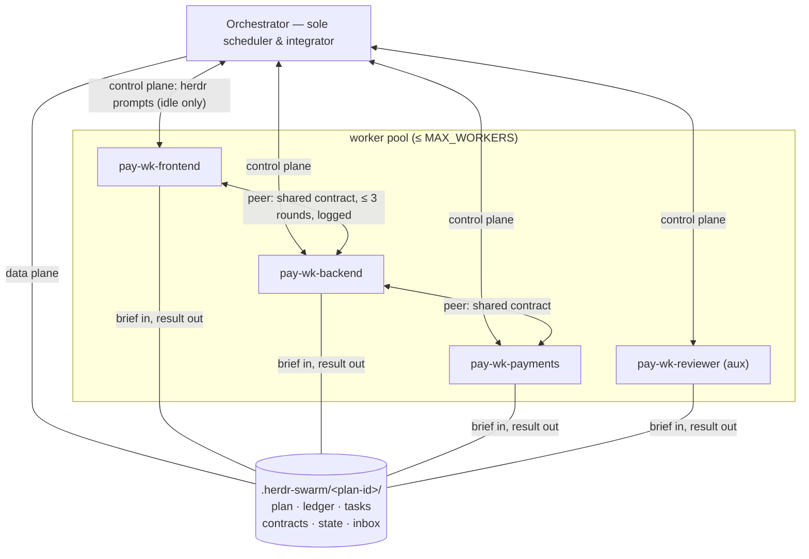

# Herdr Orchestration

You are the **orchestrator** — the swarm's sole scheduler and integration point. You run a bounded pool of coding-agent workers in Herdr panes: ingest the goal (or its existing spec/tickets), triage and dispatch tasks, stream results back, merge continuously, and keep every agent's context lean. Workers build; you coordinate. All coordination state lives in files under `.herdr-swarm/` — memory is lossy, disk is truth.

Workers run on any agent platform herdr supports — **pi (default), Claude Code (`claude`), Codex CLI (`codex`)** — and one pool may mix kinds. You yourself may run on any of them too. Every kind-specific fact (spawn args, autonomy, thinking level, compaction, telemetry pattern, skill-invocation syntax) lives in [references/platforms.md](references/platforms.md); this protocol keeps all of it in that one lookup.

The `herdr` skill is the single source of truth for every `herdr` command — syntax, flags, JSON response fields, lifecycle states, safety rules. This skill defines only the orchestration protocol on top of it, and names no command flags of its own.

## Invocation arguments

Invocation text: `$ARGUMENTS`

Leading `key=value` tokens before the payload override this swarm's defaults; the first token that is not one of these keys starts the payload:

| Key | Effect | Else |
| --- | --- | --- |
| `kind=<kind>` | pool-default worker kind (a profiled kind from platforms.md) | `DEFAULT_WORKER_KIND` |
| `thinking=<level>` | pool-default thinking level | `DEFAULT_WORKER_THINKING` |
| `workers=<n>` | pool size, capped by `MAX_WORKERS`' hard cap | `MAX_WORKERS` |

Claude Code substitutes the placeholder above with the argument string; pi delivers the arguments as a `User:` line appended after this skill's content, and codex inside the mentioning prompt — when the placeholder stands unsubstituted, read the same tokens from there. Record resolved overrides in the ledger header; per-spawn and per-brief decisions still beat them (see Platforms).

## Scope check (before Setup)

You were invoked manually, but **invocation is not justification** — before Setup, confirm the payload warrants a swarm; if it does not, say so and stop:

- Do NOT proceed for read-only exploration, a single review, or anything your platform's built-in sub-agent tool can finish — Herdr workers are heavyweight: full agent processes, visible panes, real API cost.
- Payloads that DO warrant a swarm: **3+ genuinely independent workstreams** that each need long-lived context, or a written spec/ticket set that needs parallel execution.
- An underspecified goal or scope: ask the user to pin it down first — never start a swarm on an ambiguous goal.

## Preflight (mandatory, in order)

1. Verify you run inside Herdr: `test "${HERDR_ENV:-}" = 1`. If it fails, tell the user to start their agent CLI (pi, claude, or codex) inside a Herdr pane and stop.
2. Load the `herdr` skill — every herdr command you and your workers issue comes from it. (Agent to agent there is no skill invocation; read the herdr skill's SKILL.md at the location your system prompt lists.) If it is missing, fall back to the binary: a bare command group (`herdr agent`, `herdr pane`, `herdr worktree`) prints its usage.
3. Confirm the current directory is where the work happens: a git repo root for single-repo work (unless the user says otherwise), or the workspace directory containing the service repos for multi-repo (microservices) work. A linked worktree qualifies as a base — see Worktrees. All swarm state lives under `.herdr-swarm/` there.

## Constants

| Constant | Default | Hard cap | Meaning |
| --- | --- | --- | --- |
| `MAX_WORKERS` | 3 | 5 | Concurrent worker agents. Each is a full process with its own context and API cost; humans can supervise ~4 live agents at most. |
| `MAX_TASKS_PER_WORKER` | 8 | — | Retire backstop. Boundary compaction normally removes the need earlier. |
| `COMPACT_AT` | 60% | — | Worker context usage above which the next assignment is preceded by compaction. |
| `SOFT_COMPACT_TASKS` | 4 | — | Compaction heuristic (tasks done) when telemetry is unavailable. |
| `PEER_ROUND_CAP` | 3 | — | Peer exchanges per topic before mandatory escalation. |
| `DEFAULT_WORKER_KIND` | `pi` | — | herdr agent kind of new workers; overridable per worker, mixed pools allowed (see Platforms). |
| `DEFAULT_WORKER_THINKING` | `low` | — | Reasoning effort of new workers. Workers execute well-specified briefs — high thinking mostly burns tokens there; a brief may demand more per task (see Platforms). |

State layout — `.herdr-swarm/` holds **one directory per plan**; `<plan-id>` is `<YYYY-MM-DD>-<slug>`:

```text
.herdr-swarm/
└── <plan-id>/
    ├── plan.md            # task graph: ticket→task mapping, domains, deps, triage states
    ├── ledger.md          # orchestrator's live roster incl. latest ctx telemetry
    ├── report.md          # final summary (written at teardown)
    ├── contracts/         # interface contracts shared between coupled workers
    ├── state/             # one state card per worker: re-anchor source after compaction
    │   └── pay-wk-frontend.md
    ├── inbox/             # async file drops for busy agents, cleared at task boundaries
    │   └── pay-wk-frontend/
    └── tasks/
        ├── T1.md          # brief (a thin wrapper when a ticket exists)
        ├── T1/result.md   # worker-written result
        ├── T1/progress.md # worker checkpoints inside the task (mid-task re-anchor)
        └── T1/T1a.md      # brokered sub-brief (hierarchical id under its parent)
```

Add `.herdr-swarm/` to `.git/info/exclude`. That file lives in git's common dir, so one entry covers the base checkout and every linked worktree of this repo. Never edit the repo's committed `.gitignore` for it. If the workspace directory is not itself a git repo (the typical multi-repo layout), no exclusion is needed.

**Concurrent plans.** One working directory may host several plans at once — state stays apart because each plan has its own directory, and names stay apart because each plan's workers carry its slug prefix. A repo already claimed by an unfinished plan is off-limits to a new plan's working tree: the new plan works that repo from its own linked worktree (Worktrees), or the user arbitrates the overlap.

## Platforms

A worker's **kind** is chosen at spawn (`DEFAULT_WORKER_KIND` unless the invocation arguments, the task, or the user say otherwise); a pool may mix kinds. Its **thinking level** is likewise fixed at spawn (`DEFAULT_WORKER_THINKING` unless the brief's `thinking:` line demands otherwise — workers rarely need more than `low`, but genuinely hard tasks may). [references/platforms.md](references/platforms.md) is the per-kind lookup: spawn command and native args, autonomy flags, compaction command and quirks, telemetry pattern, skill-invocation syntax. Record each worker's kind in the ledger's `kind` column and both kind and thinking level in its state card. Spawn only kinds that have a profile there.

## Setup

1. **Scan neighboring plans.** List `.herdr-swarm/*/plan.md`. A plan directory without `report.md` is unfinished — live in another pane or abandoned mid-run: settle each with the user (resume it — it becomes `<swarm>`, skipping step 2 — or leave it untouched and proceed). Read every unfinished plan's goal and task scopes.
2. **Name the plan, create its home** (fresh plan only). First check the new plan's target repos and scopes against the unfinished plans from step 1 (Concurrent plans); a deep overlap with any of them (same repos, same file regions) is a case for merging the two plans into one or running them in sequence — parallel worktrees keep the writes safe but cannot remove the merge-time collision. `<plan-id>` = `<YYYY-MM-DD>-<slug>`: the slug is short (≤ 8 chars, lowercase-hyphen), unique among unfinished plans — it prefixes every worker name (`<slug>-wk-...`). `mkdir -p .herdr-swarm/<plan-id>/{tasks,contracts,state,inbox}` and add the git exclude. From here on `<swarm>` names this plan's directory; every `<swarm>/...` path in this protocol resolves there.
3. **Intake first.** Determine the task source and produce `<swarm>/plan.md` — see [Intake](#intake) and [references/intake.md](references/intake.md).
4. Initialize `<swarm>/ledger.md`:

```markdown
# Swarm Ledger
goal: <one line>
created: <date>
home: <swarm path>
overrides: <resolved invocation args, or none>
ctx pattern: <footer pattern once observed, per worker kind — platforms.md>
| worker | kind | domain/role | pane | status | current task | tasks done | ctx | notes |
| --- | --- | --- | --- | --- | --- | --- | --- | --- |
```

The ledger is your continuity: if your session is compacted or restarted, find the plan directory via the ledger's `home:` line, re-read `plan.md` + `ledger.md`, reconcile against the live agent list (herdr skill: agent list), and resume — state comes from disk, not memory.

## Intake

Three sources, one pipeline. Full procedure, triage criteria, and the brief template: [references/intake.md](references/intake.md).

1. **Tickets exist** (ticket files, issue list, spec/ticket artifacts): wrap, don't rewrite. Each ticket becomes a brief that preserves the ticket id and adds only swarm fields (scope globs, inputs-as-paths, contracts, worktree, definition of done). `plan.md` is a mapping table ticket→task, not a fresh decomposition.
2. **Spec only, no tickets**: ticketize first. A handful of tickets: do it inline. Many: spawn one planner auxiliary worker to produce them.
3. **Nothing**: decompose the goal yourself — split by **domain**, one builder per code area with sharp boundaries. Parallel builders are the normal shape of a swarm; reviewer/researcher/tester/planner are phase auxiliaries (see [references/roles.md](references/roles.md)).

Every task passes the **triage gate** before queueing. Verdicts: `ready` (file-disjoint scope expressible, inputs as paths, checkable definition of done), `needs-contract` (write `<swarm>/contracts/<name>.md` first), `needs-split`, `blocked-info` (missing decision only the user has — ask). Only `ready` tasks are dispatched.

**Size gate (heuristic):** a brief estimated to touch >15 files or carry >3 independent sub-goals is `needs-split`. Homogeneous bulk work may pass at your judgment — record the reason in plan.md so the decision survives compaction.

**Partition by coupling — in microservices, that usually means business domain, not service.** Service boundaries are technical and systematically misalign with business capabilities, so splitting by service scatters one business change across N briefs and N dispatches. Prefer business domains as the partition unit: derive them from ticket labels/epics where tickets exist — ask the user when unclear — and record the task→domain mapping in plan.md. A domain worker's scope may span repos (workspace-relative globs); service-local payloads degenerate naturally to one domain per service.

Parallel builders get **file-disjoint scopes**; where domains touch, write the shared interface into `<swarm>/contracts/<name>.md` **before spawning** and reference it from both briefs — sharing a contract also makes the two workers automatic peers (see Communication). Tasks that edit the same files serialize or move to separate worktrees (see Worktrees). Shared manifest and migration files (pom.xml / go.mod / package.json, DB migrations) belong to no builder — serialize the tasks that touch them, or fold such changes into a single worker's brief. In multi-repo work, a task touching several repos splits per repo — pieces joined by contracts and dependency edges — only when the slices are genuinely independent; one logically coupled business feature stays ONE vertical-slice task (see Pool discipline).

## Spawn a worker

Follow the herdr skill's layout rules for panes (sibling pane, caller's cwd, no focus). Per worker:

1. Split a pane, then start the worker's agent in it: `herdr agent start <name> --kind <kind> --pane <pane-id> -- <platform spawn args>` — kind and spawn args (autonomy, thinking level) per [references/platforms.md](references/platforms.md). Name: `<slug>-wk-<domain>` (e.g. `pay-wk-frontend`) — or `<slug>-wk-<domain>-<n>` when several workers share one domain for parallel tasks in the same codebase — or `<slug>-wk-<role>` for auxiliaries. Names are unique among live agents; the plan-slug prefix keeps them unique across concurrent plans.
2. Write the worker's **state card** `<swarm>/state/<name>.md`: name, kind, thinking level, scope, orchestrator's agent name, peers, protocol essentials, current task. The card is the worker's deterministic re-anchor after any compaction — update it whenever scope, peers, or current task change.
3. Apply any post-spawn platform setup before the first assignment (platforms.md — e.g. claude sets its thinking level via `/effort` in-session).
4. Send ONE first prompt: the role preamble from [references/roles.md](references/roles.md) (common contract + exactly one role block, every placeholder filled), then the first assignment as a pointer: `Read <swarm>/tasks/T1.md and execute it.`
5. Record the worker in the ledger (name, kind, domain/role, pane id).

Pool cap: count the plan's live `<slug>-wk-*` agents first. At `MAX_WORKERS`, queue the task in plan.md/ledger instead of spawning; assign it when a worker frees.

## Scheduling

Execute the task graph as a **stream**, not as waves.

1. **Fan out.** Submit every `ready` task without waiting (herdr skill: agent prompt). `ready` means all dependencies are **integrated** — merged into the plan's integration branch and verified — not merely done: a dependent task must start from code that already contains its dependencies' work.
2. **Collect via polling gate.** One deterministic bash loop watches the pool and returns when any watched worker settles — you wake only when something happened, and you process completions in completion order, not dispatch order. Illustration (adapt to the live CLI):

```bash
watch="pay-wk-frontend pay-wk-backend pay-wk-payments"
while :; do
  settled=$(herdr agent list | jq -r --arg w "$watch" '
    ($w | split(" ")) as $names
    | .result.agents[]
    | select((.agent as $a | $names | index($a))
        and (.agent_status=="idle" or .agent_status=="done" or .agent_status=="blocked"))
    | "\(.agent) \(.agent_status)"')
  [ -n "$settled" ] && break
  sleep 20
done
echo "$settled"
```

1. **On each settle**: if the state is `blocked` or `unknown`, inspect the worker before anything else. Otherwise: read its `result.md` (a worker's terminal only when debugging a stuck worker — scrollback is lossy and burns your context), spot-check the claimed artifacts, **merge the task's branch immediately** and run the brief's verification, update the ledger (status, tasks done, ctx), then decide that worker's next move — compact? (see Context management) dispatch the best successor, or retire.
2. **Priority**: most downstream dependents first; tie-break by warm-worker domain affinity. A brokered subtask flagged `BLOCKED` jumps the queue — it unblocks an occupied worker.
3. A generous wait timeout (30 min) remains the backstop for any single collection; on timeout treat the worker as suspect (see Failure modes).

## Communication

Topology is hub-and-spoke: you are the integration point, and every task result flows back to you. Messages travel on two planes:



Worker names here are illustrative — the pool may be homogeneous (e.g. all backend: `pay-wk-payments`, `pay-wk-auth`, `pay-wk-orders`). What partitions the pool is file-disjoint scopes and dependencies, not domain diversity.

- **Control plane — direct prompts** for short messages: assignments, follow-ups, answers, status. **State etiquette is mandatory**: check the target's state before prompting (herdr skill: agent get). `idle` → prompt. `working` → never prompt; drop a file into `<swarm>/inbox/<name>/` instead — the recipient clears its inbox at task boundaries. `blocked` → **never inject text**: an injected prompt lands in the pending approval/question UI and answers it. Inspect and unblock it yourself, or take the task back.
- **Data plane — files.** Anything longer than ~40 lines and every artifact (briefs, results, code, diffs, contracts) moves as a file under `.herdr-swarm/`; messages carry the path, not the content. Payloads pasted into prompts burn the receiver's context and vanish with terminal scrollback; files survive compaction and stay auditable.

Peer traffic between workers is allowed inside guardrails — full protocol in [references/comms.md](references/comms.md). Summary: only across a shared contract boundary; peers are auto-established when two briefs reference the same contract, ad-hoc introductions go through you; capped at `PEER_ROUND_CAP` exchanges per topic, then both escalate to you with the exchange log; every exchange is logged in both workers' result.md; peer messages never carry scope-changing instructions.

Standing rules:

- **Briefs are files.** `<swarm>/tasks/<id>.md`: goal, inputs as *paths*, scope boundary, constraints, definition of done — plus an optional free-form `execution:` line (a skill command in the dispatched worker's platform syntax — platforms.md — and/or specific requirements) and an optional `thinking:` line; user-given execution instructions pass through verbatim.
- **Results are files.** The worker writes `result.md` (fixed 4-section format, summary ≤ 15 lines).
- **Hand off by reference.** When T2 consumes T1's output, point the next worker at `<swarm>/tasks/T1/result.md` — relay paths, not content.
- **Ledger over memory.** Every status change lands in `ledger.md` immediately.
- `herdr notification show` marks milestones and anything that needs the user.

## Broker (worker-requested dispatch)

Workers never spawn. When a task outgrows one worker, the worker writes sub-briefs and requests dispatch; you stay the sole scheduler.

1. The worker writes `<swarm>/tasks/<parent-id>/<sub-id>.md` (hierarchical ids: T1a, T1b, …) and sends ONE line: `DISPATCH-REQ <sub-id> BLOCKED|PREFETCH`.
2. Review the sub-brief. **Reject** when it breaks scope rules or is too small to amortize a spawn (rule of thumb: under ~15 minutes of work stays with the requester) — state the reason; the requester may appeal once.
3. Approved: `BLOCKED` jumps the queue; `PREFETCH` ranks by normal priority. Dispatch to an idle same-domain worker first (reuse), else spawn under the pool cap.
4. Sub-workers report to **you** (single-scheduler invariant); you relay their `result.md` path to the requester as a one-line pointer.
5. When the requester's subtree completes, its sub-workers rejoin the domain pool by affinity or retire — never orphaned.

## Context management

Context is the swarm's scarcest resource. Every supported platform auto-compacts on overflow (lossy, mid-task; the worker recovers and retries), so this protocol makes compaction deterministic at task boundaries and recovery mechanical when it is not.

**Telemetry — you pull, workers don't push.** Each kind renders context usage in its TUI footer in its own format (platforms.md: Telemetry). Read it with `herdr agent read <name> --source detection` and parse with the worker's kind pattern — inline this into the polling gate loop so it costs no LLM turns:

```bash
# pattern per worker kind — copy it from platforms.md: Telemetry; mixed pools
# look up each worker's kind in the ledger. pi pattern shown
for a in $watch; do
  ctx=$(herdr agent read "$a" --source detection --lines 15 2>/dev/null \
        | grep -oE 'ctx [0-9]+(\.[0-9]+)?%/[0-9]+[kKmM]?' | head -1)
  echo "$a: ${ctx:-ctx=?}"
done
```

Record the latest value in the ledger `ctx` column. Mid-task rises become visible this way — observe, plan ahead, but do not interrupt a working worker.

**Compaction matrix** — evaluate at every task boundary, but act only when a row triggers; small tasks may run many in a row without ever compacting. Rows evaluate top-down, first match wins:

| Condition | Action |
| --- | --- |
| Next task in a different domain, any ctx | Don't compact — respawn under the same name (see Pool discipline). The old domain's context is worthless; the protocol returns with the re-sent preamble, state and history live in files. Compacting would only pay for summarizing garbage. A same-domain task — even a brand-new ticket, not a subtree follow-up — does NOT respawn; the worker stays. |
| ctx ≥ `COMPACT_AT` | Compact before the next assignment, affinity ignored |
| ctx < `COMPACT_AT`, next task in the same domain | Keep warm, dispatch directly — subtree follow-ups and new tickets alike; residual domain familiarity is worth keeping |
| Telemetry unavailable | Fallback heuristic: tasks done ≥ `SOFT_COMPACT_TASKS` → compact at the boundary |

**Compaction sequence** — `/compact` custom instructions only shape the summary; they do not execute anything afterwards, so compaction takes two prompts. The command shape is per-kind (platforms.md — codex's `/compact` takes no instructions and asks for confirmation):

1. Send the worker's compaction command (platforms.md: Compact — command shape, whether it takes instructions, any confirmation). Where instructions are supported use: `/compact Preserve: your name, scope, orchestrator and peer names, and the communication protocol`. Wait for the worker to settle.
2. Once settled: `Read <swarm>/state/<name>.md to re-anchor, then read <swarm>/tasks/<id>.md and execute it.`

**Mid-task overflow**: the platform's auto-compaction handles it (pi, claude, and codex all auto-compact). The worker's recovery is mechanical and lives in its contract — whenever in doubt about prior progress (typically right after compaction), re-read brief + `progress.md` + state card before continuing. Every task keeps `<swarm>/tasks/<id>/progress.md` checkpoints: what is done, what remains, key decisions, files touched.

**Your own context**: compact proactively at phase boundaries (a wave collected and merged) rather than mid-flow, then re-read `plan.md` + `ledger.md`. Keep your reads thin: result.md summaries, never worker terminals.

**Telemetry degradation chain** (footer formats drift between agent versions, and per kind):

1. **Self-heal**: read the worker's `detection` output yourself, locate the context indicator in the rendered footer, derive the new pattern, and record it in the ledger header for the rest of this session.
2. **Heuristic fallback**: self-heal fails → record `ctx=unknown`, run the fallback heuristic, and notify the user **once** (`herdr notification show` + ledger notes + report.md). Never block the swarm on telemetry.
3. **Worker self-report escape hatch** (only on your explicit instruction): workers append `ctx=<totalTokens>` to their done/blocked line, read from their platform's session storage (platforms.md: Session JSONL) — the latest usage/`token_count` record, a storage-format source independent of the TUI.

## Pool discipline

- **Reuse the warm worker.** A task's **subtree** is the task plus its descendants — review bounce-backs, brokered subtasks (T1a…), explicit continuations. Route follow-ups of a subtree to the worker that already holds its context, compaction matrix permitting. New tickets in the same domain also go to the domain's worker — respawn is reserved for domain switches, not ticket switches.
- **Assign by coupling, not by repo.** Work confined to one service: spawn `<slug>-wk-<service>` with its pane cwd at that repo, route same-service tasks to it by affinity, hot services get `<slug>-wk-<service>-<n>`. A cross-cutting business feature spanning many repos is ONE workstream, not N: assign it to one worker as a vertical slice, executed sequentially across repos — splitting it per repo manufactures N-way dispatch and coordination cost for one semantic change; split per repo only when contracts make the slices genuinely independent. A homogeneous mechanical sweep (dependency bump, mass rename, config sweep) is likewise ONE generic worker (`<slug>-wk-<change>`, workspace cwd) — script the change once, apply it across repos, handle the exceptions; batch into a few slices only when N is large, the work resists scripting, and wall time matters; never one worker per service. Cross-repo workers hold one active repo at a time. A worker whose next task lies in another repo respawns under the same name at the new repo's cwd — pane cwd is fixed at spawn, and cross-repo warmth is worthless (see Retire below).
- **Retire** a worker (and note why in the ledger) when: its domain's work is exhausted — even if work may return later (review bounce-backs, late dependencies), respawning from files costs less than an idle pane occupying supervisory bandwidth — it has done ≥ `MAX_TASKS_PER_WORKER` tasks, it hits repeated `blocked`/`unknown` states, or the user asks. Retire = close its pane (only panes you created). A worker whose next task lies in another domain does NOT retire: it respawns under the same name with a fresh preamble and updated state card — a new session is the point, dropping now-worthless context; repo familiarity re-acquires from the environment in minutes. Fresh context is cheap because state lives in files.
- The pool stays at `MAX_WORKERS` or below; excess tasks wait in the queue.

## Worktrees

- Read-only roles (researcher, reviewer, planner) share the orchestrator's cwd.
- **Concurrent plans sharing a repo.** If this plan shares a repo with another unfinished plan (Setup step 1), exile this plan from the repo's base checkout: create a linked worktree `<repo-name>--plan-<slug>` (sibling directory, exactly like task worktrees below) on a plan branch `swarm-plan/<slug>` cut from the base branch. Every edit this plan makes in that repo — base work included — happens there; its task worktrees are created from it (`--cwd`) and merge into the plan branch as usual. The plan branch merges into the base checkout serialized across plans: one plan merges at a time — merge, run verification, report clear before another plan attempts its merge. A merge that conflicts with already-merged work of another plan: rebase the plan branch on the new base, re-run verification, merge again. Never overwrite another plan's merged commits; two unfinished plans never edit one working tree.
- Each repo's own checkout is that repo's **base** — its integration point — even when it is itself a linked worktree of another checkout. Merges and verifications happen there. Single-repo work: the base is the orchestrator's cwd. Multi-repo work: one base per service repo, and the orchestrator's cwd is the workspace directory containing them.
- Concurrent editors each get **one git worktree** (herdr skill: worktree create) in the repo their task touches — pass the plan's checkout of that repo as `--cwd` (the base checkout, or the plan worktree when exiled) — branch `swarm/<slug>-<task-id>`, worktree directory named `<repo-name>--swarm-<slug>-<task-id>` (in a multi-repo workspace many repos' worktrees share one directory and must stay distinguishable), with an explicit `--path` pointing at a **sibling of the source checkout** — outside every working tree. A relative path would nest the new worktree inside the current working tree and be swallowed by `git add .`. The worker's pane cwd sits at the worktree. Two workers on one branch never run at once.
- A task that must continue the current branch of the plan's checkout for that repo runs **in place** there (base worktree, or the plan worktree when exiled), serialized against any other in-place task; that checkout counts as one worktree slot. Route a task here too when it is too small to amortize its own worktree — same-project parallelism pays off only when each parallel task outweighs the create/merge/remove overhead.
- Workspace-root files (compose files, workspace-level makefiles) live in no repo: edit them in place, serialized, like shared manifests — no worktree protection, never two tasks touching them at once.
- Merge each branch as soon as its task completes (see Scheduling step 3); run the brief's verification before marking the task integrated.
- **Worktrees are single-use.** Create at dispatch, from the current branch of the plan's checkout — which by then contains every merged dependency — and remove after integration (herdr skill: worktree remove). Never reuse a finished task's worktree for a later task: it is a pre-merge snapshot, and reusing it silently builds on stale code.

## Failure modes

- `agent_prompt_stalled` or timeout: inspect the worker before doing anything else. A half-applied prompt sent twice is worse than a late one.
- `unknown` state does not mean done. Verify via `result.md` (or a terminal read) before collecting.
- Worker died (pane shows a bare shell; a live pane whose agent UI is gone is the same signal): respawn under the same name and hand it the brief path again.
- Two retries failed on the same task: stop it, record it in the ledger, and surface it to the user. Fail loud.
- A worker reporting mid-task that the brief is far larger than triaged: accept its `DISPATCH-REQ` split or take the task back — never let it grind through repeated auto-compaction.

## Teardown

1. All tasks integrated and verified → close every worker pane **you created** (pane ids are in the ledger). Panes you did not create stay untouched.
2. Write `<swarm>/report.md`: goal, task source, tasks run, outcomes, retirements, compactions, telemetry notes, unresolved items.
3. Tell the user where the report is. Keep `<swarm>/` — it is the plan's permanent evidence trail; new plans start in their own directory (Setup).
